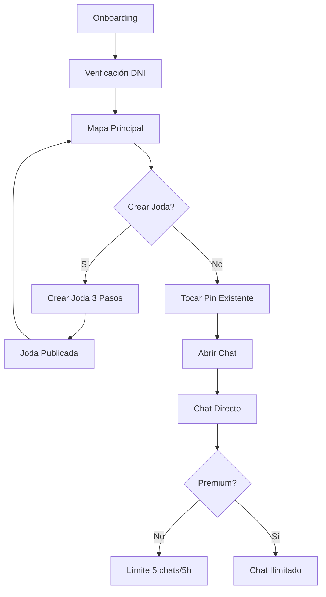

## 1. Product Overview
Vibe es una aplicación móvil que conecta personas en tiempo real para descubrir jodas y previas cercanas. Resuelve el problema de encontrar planes espontáneos y conectar con gente nueva sin barreras de match.

Dirigido a jóvenes adultos (18-35 años) que buscan experiencias sociales espontáneas. El valor principal es la conexión inmediata sin fricciones y la privacidad temporal con el reset diario.

## 2. Core Features

### 2.1 User Roles
| Role | Registration Method | Core Permissions |
|------|---------------------|------------------|
| Usuario Free | Email + verificación DNI/Selfie | Crear 1 joda, 5 chats cada 5h, ver mapa |
| Usuario Premium | Suscripción $5/mes | Chats ilimitados, badge destacado, boost gratis mensual |
| Usuario B2B | Contacto comercial | Crear pines especiales con logo de establecimiento |

### 2.2 Feature Module
Nuestra aplicación consiste en las siguientes pantallas principales:
1. **Onboarding/Auth**: flujo de registro, verificación de identidad con DNI y selfie.
2. **Mapa principal**: visualización de jodas cercanas con pines interactivos, filtros por distancia y privacidad.
3. **Mi Vibe**: gestión de tu joda actual, lista de chats activos, configuración de perfil.
4. **Crear Joda**: modal en 3 pasos para crear evento con ubicación, descripción y privacidad.

### 2.3 Page Details
| Page Name | Module Name | Feature description |
|-----------|-------------|---------------------|
| Onboarding | Registro | Ingresar email, contraseña, nombre y edad. Validar mayoría de edad. |
| Onboarding | Verificación | Subir foto de DNI y selfie. Sistema OCR para validar coincidencia. |
| Mapa | Visualización | Mostrar mapa con pines de jodas. Filtros por distancia (hasta 50km). |
| Mapa | Interacción Pin | Tocar pin → ver preview → abrir chat directo con creador. |
| Mapa | Mi Ubicación | Botón para centrar mapa en ubicación actual. Actualización en tiempo real. |
| Mi Vibe | Mi Joda | Crear/editar/eliminar mi joda actual. Ver miembros unidos. |
| Mi Vibe | Chats | Lista de conversaciones activas. Indicador de mensajes no leídos. |
| Mi Vibe | Perfil | Editar foto, descripción, ver estado de verificación. |
| Crear Joda | Paso 1 | Elegir ubicación en mapa o usar ubicación actual. |
| Crear Joda | Paso 2 | Escribir descripción (máx 140 caracteres), elegir privacidad. |
| Crear Joda | Paso 3 | Invitar amigos de la app, confirmar y publicar. |

## 3. Core Process
### Flujo Usuario Free
1. Usuario abre app → Onboarding → Verificación DNI/Selfie → Mapa principal
2. En mapa: ve pines cercanos → toca pin → preview joda → toca "Chatear" → chat directo
3. Límite: máximo 5 chats nuevos cada 5 horas
4. A las 09:00 AM: todo se borra automáticamente (jodas, chats, fotos)

### Flujo Creador de Joda
1. Usuario verificado → toca "Crear Joda" → selecciona ubicación → describe evento → elige privacidad
2. Publica joda → aparece en mapa → otros usuarios pueden unirse via chat
3. Puede invitar amigos de la app a su joda
4. Control total sobre quién puede unirse mediante aceptación en chat

### Flujo Premium
1. Suscripción mensual $5 USD → chats ilimitados → badge verificado destacado
2. Boost gratis mensual: pin resaltado en mapa, aparece primero en listas
3. Acceso prioritario a nuevas features

## 4. User Interface Design

### 4.1 Design Style
- **Colores**: Fondo negro absoluto (#000000), textos blancos (#FFFFFF), acentos cyan neón (#00FFFF) y magenta neón (#FF00FF)
- **Botones**: Estilo neón con bordes brillantes, efecto glow on hover
- **Tipografía**: Fuente sans-serif moderna (Inter/Roboto), tamaños 14-24px para móvil
- **Layout**: Card-based para contenido, navegación inferior tipo tabs
- **Iconos**: Estilo outline minimalista con versión filled para estados activos

### 4.2 Page Design Overview
| Page Name | Module Name | UI Elements |
|-----------|-------------|-------------|
| Onboarding | Registro | Fondo negro, inputs con bordes cyan, botón magenta neón con glow effect |
| Mapa | Visualización | Mapa oscuro personalizado, pines con halo neón (cyan para públicas, magenta para secretas) |
| Mapa | Preview Pin | Card semi-transparente con blur, bordes neón, botón de chat prominente |
| Mi Vibe | Mi Joda | Card principal con gradiente neón, lista de miembros con avatares circulares |
| Mi Vibe | Chats | Lista con avatares, indicadores neón para mensajes nuevos, swipe para opciones |
| Crear Joda | Paso 1 | Mapa interactivo con selector de ubicación, botón "Usar mi ubicación" |

### 4.3 Responsiveness
Mobile-first design optimizado para iOS/Android. Touch targets mínimos 44x44px. Gestos de swipe para navegación. Adaptación automática a notch y safe areas.

### 4.4 Animaciones
- Transiciones entre pantallas: slide horizontal suave (300ms)
- Efectos neón: pulso continuo en pines activos (2s loop)
- Microinteracciones: vibración ligera al recibir mensaje, feedback táctil en botones
- Skeleton loading con efecto shimmer neón mientras carga contenido