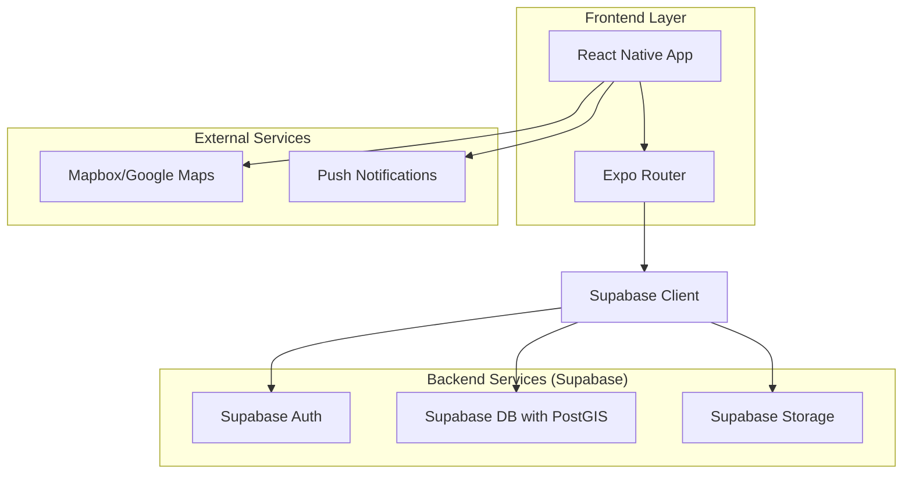
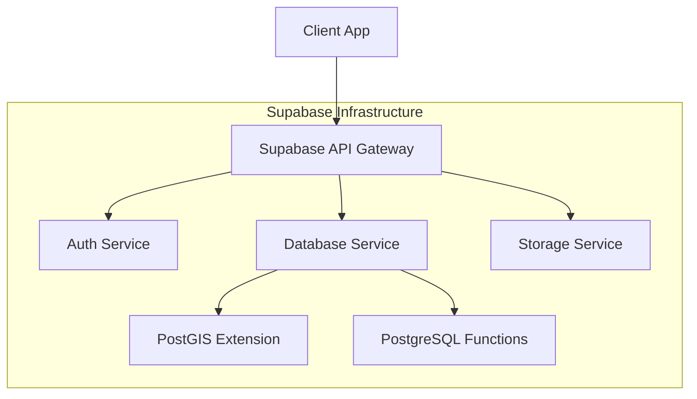
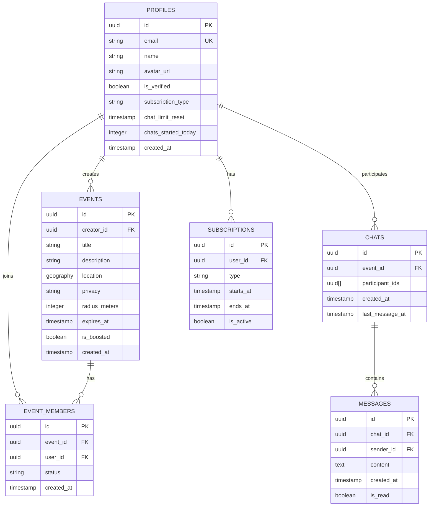

## 1. Architecture design



## 2. Technology Description
- **Frontend**: React Native + Expo + NativeWind (Tailwind CSS)
- **Navigation**: Expo Router v3
- **Backend**: Supabase (Auth, PostgreSQL con PostGIS, Storage)
- **Maps**: Mapbox GL JS / Google Maps SDK
- **State Management**: React Context + SWR
- **TypeScript**: Strict mode habilitado

## 3. Route definitions
| Route | Purpose |
|-------|---------|
| /(auth)/onboarding | Flujo inicial de registro y verificación |
| /(auth)/login | Pantalla de login existente |
| /(tabs)/map | Mapa principal con pines de jodas |
| /(tabs)/my-vibe | Gestión personal y chats |
| /(tabs)/profile | Perfil de usuario |
| /create-event | Modal de creación de joda (3 pasos) |
| /chat/[id] | Chat individual con usuario |

## 4. API definitions

### 4.1 Core API Endpoints

**Authentication**
```
POST /auth/v1/signup
POST /auth/v1/token
POST /auth/v1/logout
```

**Events (Jodas)**
```
GET /rest/v1/events?select=*&location=eq.{lat},{lng}&radius=eq.10000
POST /rest/v1/events
PUT /rest/v1/events?id=eq.{id}
DELETE /rest/v1/events?id=eq.{id}
```

**Chats & Messages**
```
GET /rest/v1/chats?user_id=eq.{userId}
POST /rest/v1/chats
GET /rest/v1/messages?chat_id=eq.{chatId}
POST /rest/v1/messages
```

### 4.2 TypeScript Interfaces
```typescript
interface Profile {
  id: string
  email: string
  name: string
  avatar_url?: string
  is_verified: boolean
  subscription_type: 'free' | 'premium'
  chat_limit_reset: Date
  chats_started_today: number
  created_at: Date
}

interface Event {
  id: string
  creator_id: string
  title: string
  description: string
  location: { lat: number; lng: number }
  privacy: 'public' | 'secret'
  radius_meters: number
  expires_at: Date
  is_boosted: boolean
  created_at: Date
}

interface Chat {
  id: string
  event_id?: string
  participant_ids: string[]
  created_at: Date
  last_message_at: Date
}

interface Message {
  id: string
  chat_id: string
  sender_id: string
  content: string
  created_at: Date
  is_read: boolean
}
```

## 5. Server architecture diagram



## 6. Data model

### 6.1 Data model definition


### 6.2 Data Definition Language

```sql
-- Tabla de perfiles
CREATE TABLE profiles (
    id UUID PRIMARY KEY DEFAULT auth.uid(),
    email TEXT UNIQUE NOT NULL,
    name TEXT NOT NULL,
    avatar_url TEXT,
    is_verified BOOLEAN DEFAULT FALSE,
    subscription_type TEXT DEFAULT 'free' CHECK (subscription_type IN ('free', 'premium')),
    chat_limit_reset TIMESTAMP WITH TIME ZONE DEFAULT NOW(),
    chats_started_today INTEGER DEFAULT 0,
    created_at TIMESTAMP WITH TIME ZONE DEFAULT NOW()
);

-- Tabla de eventos (jodas)
CREATE TABLE events (
    id UUID PRIMARY KEY DEFAULT gen_random_uuid(),
    creator_id UUID REFERENCES profiles(id) ON DELETE CASCADE,
    title TEXT NOT NULL,
    description TEXT NOT NULL,
    location GEOGRAPHY(POINT, 4326) NOT NULL,
    privacy TEXT NOT NULL CHECK (privacy IN ('public', 'secret')),
    radius_meters INTEGER DEFAULT 500,
    expires_at TIMESTAMP WITH TIME ZONE DEFAULT (NOW() + INTERVAL '24 hours'),
    is_boosted BOOLEAN DEFAULT FALSE,
    created_at TIMESTAMP WITH TIME ZONE DEFAULT NOW()
);

-- Índice espacial para búsquedas geográficas
CREATE INDEX idx_events_location ON events USING GIST (location);

-- Tabla de miembros de eventos
CREATE TABLE event_members (
    id UUID PRIMARY KEY DEFAULT gen_random_uuid(),
    event_id UUID REFERENCES events(id) ON DELETE CASCADE,
    user_id UUID REFERENCES profiles(id) ON DELETE CASCADE,
    status TEXT DEFAULT 'pending' CHECK (status IN ('pending', 'accepted', 'rejected')),
    created_at TIMESTAMP WITH TIME ZONE DEFAULT NOW(),
    UNIQUE(event_id, user_id)
);

-- Tabla de chats
CREATE TABLE chats (
    id UUID PRIMARY KEY DEFAULT gen_random_uuid(),
    event_id UUID REFERENCES events(id) ON DELETE SET NULL,
    participant_ids UUID[] NOT NULL,
    created_at TIMESTAMP WITH TIME ZONE DEFAULT NOW(),
    last_message_at TIMESTAMP WITH TIME ZONE DEFAULT NOW()
);

-- Tabla de mensajes
CREATE TABLE messages (
    id UUID PRIMARY KEY DEFAULT gen_random_uuid(),
    chat_id UUID REFERENCES chats(id) ON DELETE CASCADE,
    sender_id UUID REFERENCES profiles(id) ON DELETE CASCADE,
    content TEXT NOT NULL,
    created_at TIMESTAMP WITH TIME ZONE DEFAULT NOW(),
    is_read BOOLEAN DEFAULT FALSE
);

-- Tabla de suscripciones
CREATE TABLE subscriptions (
    id UUID PRIMARY KEY DEFAULT gen_random_uuid(),
    user_id UUID REFERENCES profiles(id) ON DELETE CASCADE,
    type TEXT NOT NULL CHECK (type IN ('premium', 'boost')),
    starts_at TIMESTAMP WITH TIME ZONE DEFAULT NOW(),
    ends_at TIMESTAMP WITH TIME ZONE NOT NULL,
    is_active BOOLEAN DEFAULT TRUE
);

-- Función RPC para buscar eventos por radio
CREATE OR REPLACE FUNCTION get_events_within_radius(
    center_lat DOUBLE PRECISION,
    center_lng DOUBLE PRECISION,
    radius_km INTEGER DEFAULT 10
)
RETURNS SETOF events AS $$
BEGIN
    RETURN QUERY
    SELECT *
    FROM events
    WHERE ST_DWithin(
        location,
        ST_SetSRID(ST_MakePoint(center_lng, center_lat), 4326)::geography,
        radius_km * 1000
    )
    AND expires_at > NOW()
    ORDER BY ST_Distance(location, ST_SetSRID(ST_MakePoint(center_lng, center_lat), 4326)::geography);
END;
$$ LANGUAGE plpgsql;

-- Políticas de seguridad Supabase (RLS)
-- Permitir lectura de eventos públicos a usuarios anónimos
CREATE POLICY "Public events are viewable by everyone" ON events
    FOR SELECT USING (privacy = 'public');

-- Permitir acceso completo a usuarios autenticados
CREATE POLICY "Authenticated users have full access" ON events
    FOR ALL USING (auth.uid() IS NOT NULL);

-- Grant permissions
GRANT SELECT ON events TO anon;
GRANT ALL PRIVILEGES ON events TO authenticated;
GRANT ALL PRIVILEGES ON profiles TO authenticated;
GRANT ALL PRIVILEGES ON chats TO authenticated;
GRANT ALL PRIVILEGES ON messages TO authenticated;

-- Función para reset diario a las 09:00 AM
CREATE OR REPLACE FUNCTION daily_reset()
RETURNS void AS $$
BEGIN
    DELETE FROM events WHERE expires_at < NOW();
    DELETE FROM chats WHERE last_message_at < NOW() - INTERVAL '24 hours';
    DELETE FROM messages WHERE created_at < NOW() - INTERVAL '24 hours';
    UPDATE profiles SET chats_started_today = 0, chat_limit_reset = NOW();
END;
$$ LANGUAGE plpgsql;

-- Programar el reset diario (requiere extensión pg_cron)
-- SELECT cron.schedule('daily-reset', '0 9 * * *', 'SELECT daily_reset()');
```